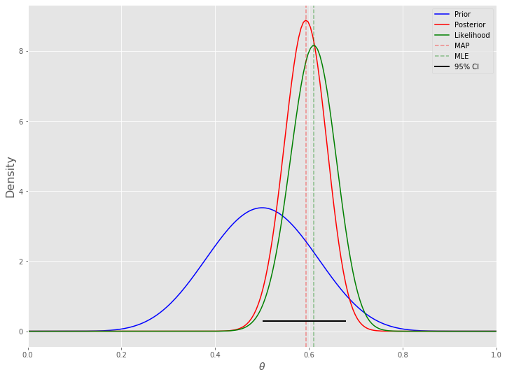
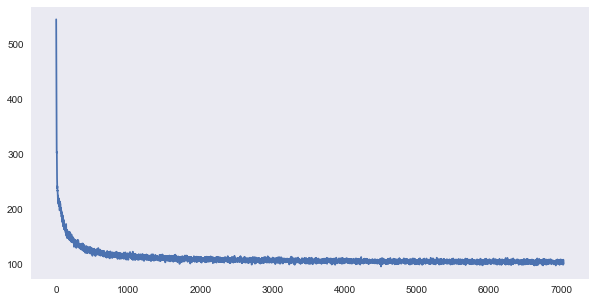
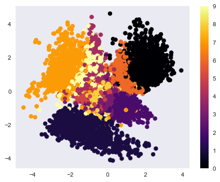
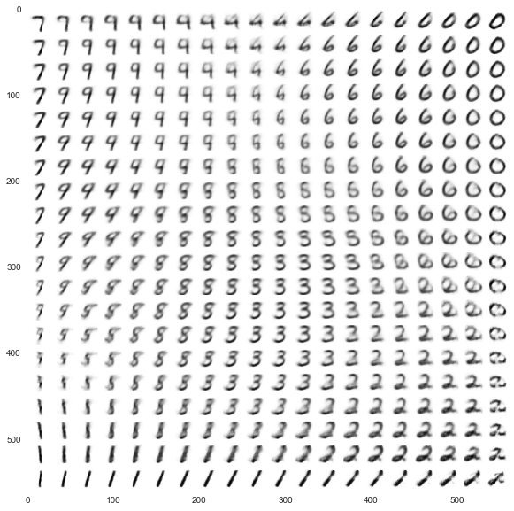

# Bayesian Deep Learning
A collection of papers reproduced on Bayesian deep learning like MCMC, VAE, Bayes by Backprop etc.

This repository contains:

1. Unofficial code for paper "An Introduction to MCMC for Machine Learning"
2. Unofficial code for paper "Auto-Encoding Variational Bayes"
3. Unofficial code for paper "Weight Uncertainty in Neural Networks"

## If this repository helps you in anyway, show your love :heart: by putting a :star: on this project :v:

## 1. Markov Chain Monte Carlo (MCMC)

The fundamental objective of Bayesian data analysis is to determine the posterior distribution

`p(θ | X)=p(X | θ)p(θ)p(X)` 

where the denominator is

`p(X)=∫dθ∗p(X | θ∗)p(θ∗)`

Here,

`p(X | θ)` is the likelihood, `p(θ)` is the prior and `p(X)` is a normalizing constant also known as the evidence or marginal likelihood

We will use the toy example of estimating the bias of a coin given a sample consisting of n tosses to illustrate a few of the approaches.

Analytical solution 

If we use a beta distribution as the prior, then the posterior distribution has a closed form solution. This is shown in the example below. Some general points:

We need to choose a prior distribtuiton family (i.e. the beta here) as well as its parameters (here a=10, b=10) The prior distribution may be relatively uninformative (i.e. more flat) or inforamtive (i.e. more peaked) The posterior depends on both the prior and the data As the amount of data becomes large, the posterior approximates the MLE An informative prior takes more data to shift than an uninformative one Of course, it is also important the model used (i.e. the likelihood) is appropriate for the fitting the data The mode of the posterior distribution is known as the maximum a posteriori (MAP) estimate (MLE which is the mode of the likelihood).





## 2. Variational Autoencoder (VAE)

Variational Autoencoder (VAE): in neural net language, a VAE consists of an encoder, a decoder, and a loss function. In probability model terms, the variational autoencoder refers to approximate inference in a latent Gaussian model where the approximate posterior and model likelihood are parametrized by neural nets (the inference and generative networks).

Loss function: in neural net language, we think of loss functions. Training means minimizing these loss functions. But in variational inference, we maximize the ELBO (which is not a loss function). This leads to awkwardness like calling optimizer.minimize(-elbo) as optimizers in neural net frameworks only support minimization.

Encoder: in the neural net world, the encoder is a neural network that outputs a representation zz of data xx. In probability model terms, the inference network parametrizes the approximate posterior of the latent variables zz. The inference network outputs parameters to the distribution q(z \mid x)q(z∣x).

Decoder: in deep learning, the decoder is a neural net that learns to reconstruct the data xx given a representation zz. In terms of probability models, the likelihood of the data xx given latent variables zz is parametrized by a generative network. The generative network outputs parameters to the likelihood distribution p(x \mid z)p(x∣z).

Inference: in neural nets, inference usually means prediction of latent representations given new, never-before-seen datapoints. In probability models, inference refers to inferring the values of latent variables given observed data.

VAE are built using the following six steps:

- An input image is passed through an encoder network.
- The encoder outputs parameters of a distribution Q(z|x).
- A latent vector z is sampled from Q(z|x). If the encoder learned to do its job well, most chances are z will contain the information describing x.
- The decoder decodes z into an image.
- Reconstruction error: the output should be similar to the input.
- Q(z|x) should be similar to the prior (multivariate standard Gaussian).








## 3. Bayes by BackProp

Bayes by Backprop that will most likely be seen as a break-through in probabilistic deep learning in some time. It symbolises a practical solution on how the issue of the uncertainity can be adequately solved. We define a simplified approximate distribution q with its variational parameters θ that shall be as similar as possible to the underlying true distribution p that cannot be calculated. This is realised by minimising the Kullback-Leibler (KL) divergence between p and q, which is an optimization problem. We approximate the underlying true distribution p with an approximate distribution q whose shape is represented by parameters θ that can be learnt, and second sample from that q while seeing data.

Local Reparameterization Trick

Let us once again remember that we want to implement the above procedure in a neural network, and therefore must calculate derivatives of the parameters being learnt, i.e. for us, derivatives of distributions. For doing so, the local reparameterisation trick is deployed which moves the parameters to be learnt, namely the mean µ and the standard deviation σ in case of a Gaussian distribution, out of the distribution function for any weight w. We define that ϵ as a sample of a standard Gaussian distribution, multiply it with the standard deviation σ and add the mean µ. Doing so, we have these two parameters of interest incorporated in every weight value and can both calculate the derivative of it and re-write it into a probability distribution.


## References

1. https://towardsdatascience.com/bayesian-inference-problem-mcmc-and-variational-inference-25a8aa9bce29

2. https://github.com/Joseph94m/MCMC

3. https://towardsdatascience.com/intuitively-understanding-variational-autoencoders-1bfe67eb5daf

4. https://github.com/ChengBinJin/VAE-Tensorflow

5. https://jaan.io/what-is-variational-autoencoder-vae-tutorial/

6. https://arxiv.org/abs/1505.05424

7. http://krasserm.github.io/2019/03/14/bayesian-neural-networks/

8. https://medium.com/neuralspace/bayesian-convolutional-neural-networks-with-bayes-by-backprop-c84dcaaf086e

9. https://www.cs.ubc.ca/~arnaud/andrieu_defreitas_doucet_jordan_intromontecarlomachinelearning.pdf

10. https://arxiv.org/abs/1312.6114

11. https://arxiv.org/abs/1505.05424


## Citing

```
@misc{Abhinav:2020,
  Author = {Abhinav Sagar},
  Title = {Bayesian Deep Learning},
  Year = {2020},
  Publisher = {GitHub},
  Journal = {GitHub repository},
  Howpublished = {\url{https://github.com/abhinavsagar/bayesian-deep-learning}}
}
```
